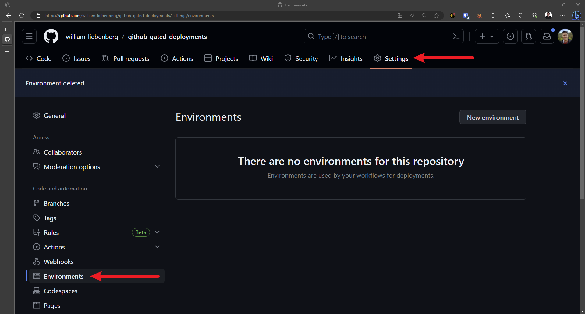
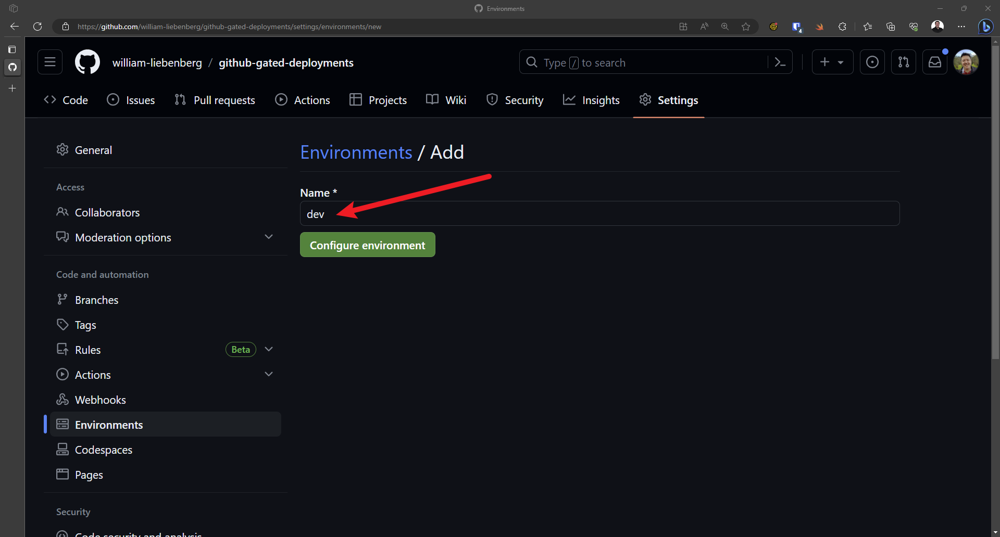
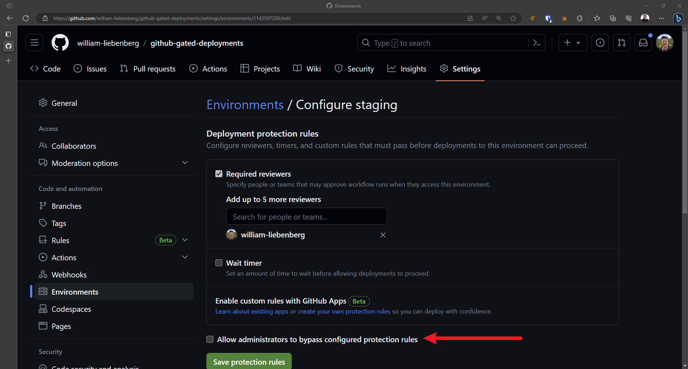
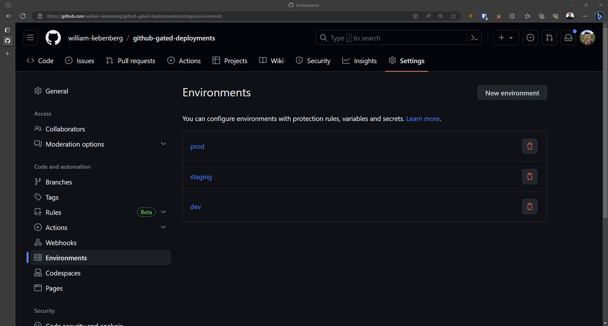

# How to set up manual approvals with Github Environments

This repo shows how to set up GitHub approval gates that will require a user to [review and approve](https://docs.github.com/en/actions/managing-workflow-runs/reviewing-deployments) the changes before they are deployed to an individual [environment](https://docs.github.com/en/actions/deployment/targeting-different-environments/using-environments-for-deployment).

Figure: Enable workflow write permissions

## Add new Environment and Required Reviewers

To add a new Environment:

1. Go to **Settings | Environments**
2. Select **New environment**

Figure: No environments (yet)

3. Give the environment a name (e.g. dev, staging, prod)
4. Select **Configure environment**

Figure: Creating new environment

5. Check **Require reviewers**
6. Add one or more required reviewers by searching for their names

 
Figure: Adding required reviewers

7. Prevent Admin users from misbehaving - don't allow them to bypass the protection rules in this environment

Figure: Prevent Admins from doing dodgy things!

1. Select **Save protection rules**
2. Repeat for other environments

Figure: All configured environments
