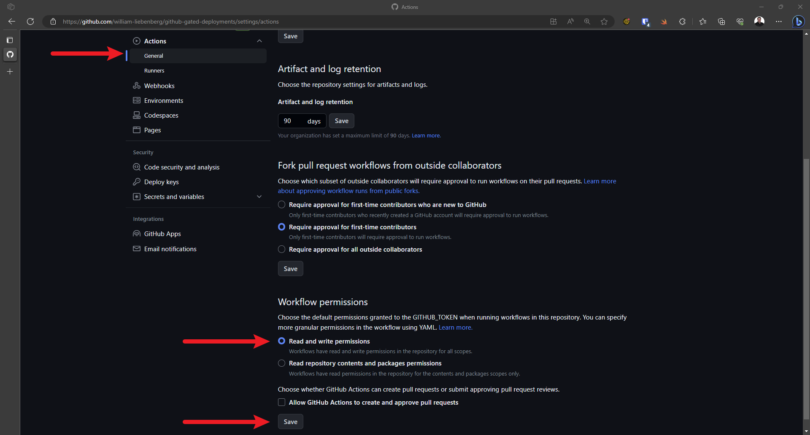

# github-gated-deployments

This repo shows how to set up GitHub approval gates that will require a user to [review and approve](https://docs.github.com/en/actions/managing-workflow-runs/reviewing-deployments) the changes before they are deployed to an individual [environment](https://docs.github.com/en/actions/deployment/targeting-different-environments/using-environments-for-deployment).

